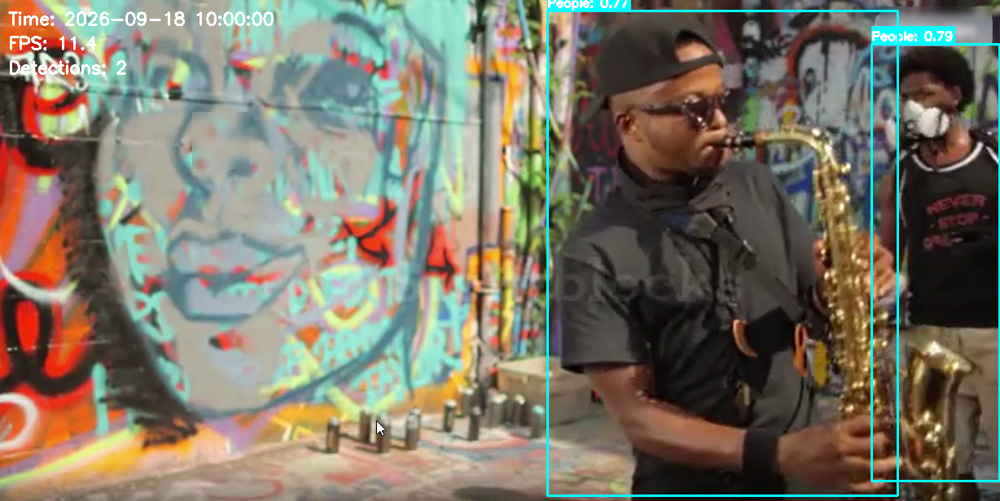
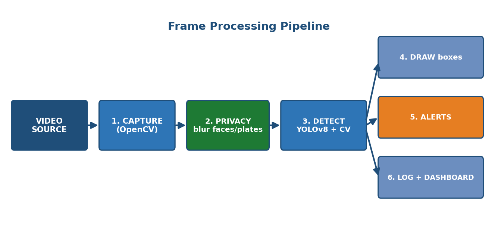
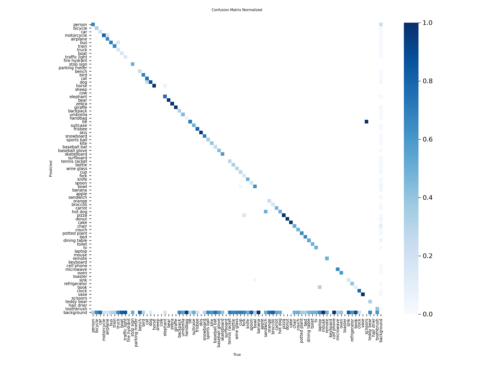

# 🏙️ Smart City Surveillance System

**Real-time object detection with automatic privacy protection**, built with Streamlit, OpenCV, and YOLOv8.


A web app that monitors a camera or video feed, detects civic objects (graffiti, posters, dustbins) and traffic (people, vehicles, bicycles), automatically **blurs faces and license plates** for privacy, raises alerts, and produces a live analytics dashboard with downloadable reports.

---

## 📸 Output Preview



*Real output from the pipeline: YOLOv8 detects people (cyan boxes), a face is automatically blurred for privacy, and the live overlay shows timestamp, FPS, and detection count.*

---

## ✨ Features

- **Real-time video** from webcam, IP camera (RTMP/HTTP), or an uploaded file
- **Object detection** — people, vehicles, bicycles via YOLOv8; graffiti & posters via custom OpenCV logic
- **Privacy protection** — automatic face and license-plate blurring with adjustable intensity
- **Real-time alerts** — severity levels (LOW / MEDIUM / HIGH / CRITICAL) with anti-spam cooldown
- **Analytics dashboard** — live metrics and interactive Plotly charts
- **Reports** — export detections as CSV or a JSON analytics report with recommendations
- **Graceful fallback** — degrades to classical computer vision if AI libraries are unavailable

---

## 🏗️ Architecture



Every frame flows through the same pipeline:

**Capture → Privacy blur → Detect (YOLOv8 + OpenCV) → Draw boxes / Alerts / Log → Display + Dashboard**

| File | Responsibility |
|------|----------------|
| `app.py` | Streamlit UI + live display loop |
| `utils/video_processor.py` | Runs one frame through the whole pipeline |
| `detection_engine.py` | YOLOv8 + custom OpenCV detectors, draws boxes |
| `privacy_filter.py` | Blurs faces and license plates |
| `utils/alert_system.py` | Threaded alert queue with severity + cooldown |
| `dashboard.py` | Live Plotly analytics |
| `report_generator.py` | CSV + JSON reports |
| `models/yolo_models.py` | YOLO model-management utility |

---

## 🚀 Setup & Run

### Prerequisites
- Python 3.11+

### Installation
```bash
git clone https://github.com/jeevashree2006/smartcitysurveillance.git
cd smartcitysurveillance

python -m venv venv
venv\Scripts\activate            # Windows
# source venv/bin/activate       # macOS / Linux

pip install -r requirements.txt
```

### Run
```bash
streamlit run app.py --server.port 5000
```

Open **http://localhost:5000**, then in the sidebar:
1. Choose a **Video Source** — *Video File* is easiest (a sample `temp_video.mp4` is included).
2. Pick detection targets, confidence, and privacy settings.
3. Click **🎬 Start Surveillance** to see the live annotated feed.
4. Click **⏹️ Stop** to view the analytics dashboard and download reports.

---

## 📊 Model Performance

Measured for the **YOLOv8n** object detector on the **COCO128** validation set (`model.val(data='coco128.yaml')`):

| Metric | Value |
|--------|-------|
| mAP@0.5 | **0.607** |
| mAP@0.5:0.95 | **0.448** |
| Precision (mean) | **0.639** |
| Recall (mean) | **0.536** |

### Confusion Matrix


> **Scope note:** These figures reflect the **pre-trained YOLOv8n** model (the object-detection component: people, vehicles, etc.) evaluated on COCO128. Graffiti and poster detection use classical OpenCV heuristics and are **not** part of this evaluation. To evaluate on your own labelled data, run `YOLO('yolov8n.pt').val(data='your_dataset.yaml')`.

---

## 📁 Project Structure

```
smartcitysurveillance/
├── app.py                    # Streamlit app + live display loop
├── detection_engine.py       # YOLOv8 + custom OpenCV detection
├── privacy_filter.py         # Face & license-plate blurring
├── dashboard.py              # Plotly analytics dashboard
├── report_generator.py       # CSV / JSON report generation
├── simple_app.py             # UI-only demo (no processing)
├── utils/
│   ├── video_processor.py    # Per-frame pipeline driver
│   └── alert_system.py       # Threaded alert queue
├── models/
│   └── yolo_models.py        # YOLO model-management utility
├── data/detection_logs.csv   # Detection log store
├── streamlit/config.toml     # Server config
├── assets/                   # README images
├── yolov8n.pt                # Pre-trained YOLOv8-nano weights
├── requirements.txt
└── README.md
```

---

## 🔒 Privacy by Design

Faces and license plates are **automatically blurred before frames are displayed or stored**. Detection runs on the original (sharp) frame for accuracy, while the visible/stored frame is anonymised — so the system monitors civic issues without identifying individuals. Deployments should also add access controls, audit logs, and data-retention limits, and comply with regulations such as GDPR / DPDP.

---

## 🧰 Tech Stack

**Python · Streamlit · OpenCV · YOLOv8 (Ultralytics) · PyTorch · Plotly · Pandas · NumPy**

---

## 📄 License

Built for educational and demonstration purposes. Ensure compliance with local privacy laws when deploying surveillance systems.
